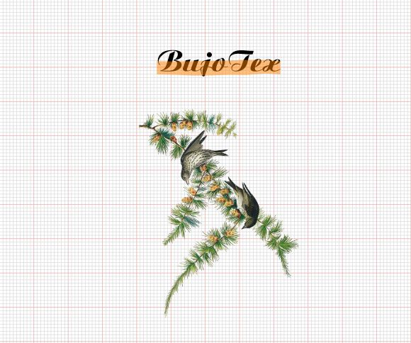
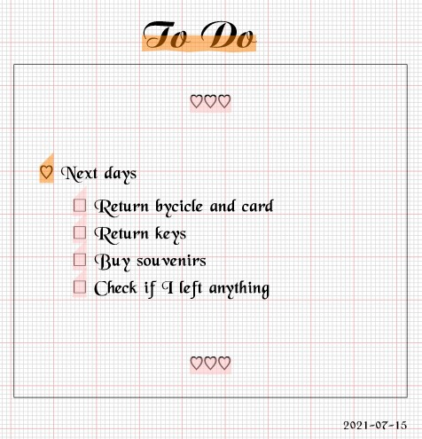
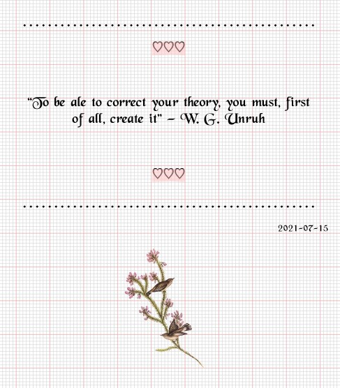

# BuJoTeX

<figure>
    	
</figure>

Some tricks to make LaTeX codes more Bullet Journal -esque. 

<figure>
    	
</figure>

Enjoy and let me know if you have any ideas to make it cuter :) 

<figure>
    	
</figure>
