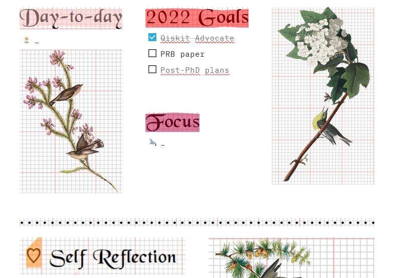

# BuJoTeX

Some tricks to make LaTeX codes more Bullet Journal -esque. 

<figure>
    	
</figure>

Here is an application: create headers for Notion, for a collage look :)

<figure>
    	
</figure>

Enjoy and let me know if you have any ideas to make it cuter!

<figure>
    	
</figure>
